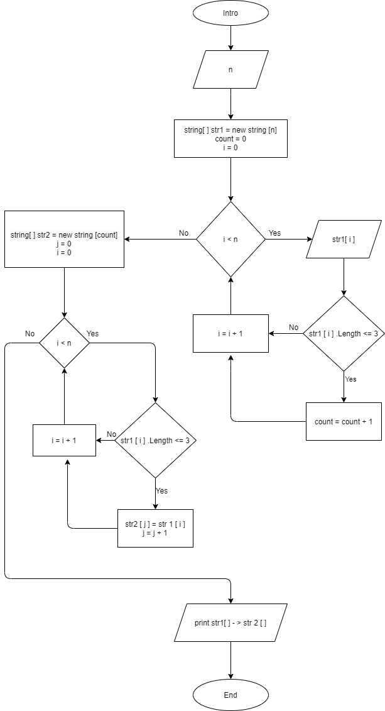

# Итоговая проверочная работа

*Написать программу, которая из имеющегося массива строк формирует массив из строк, длина которых меньше, либо равна 3 символа. Первоначальный массив можно ввести с клавиатуры, либо задать на старте выполнения алгоритма. При решении не рекомендуется пользоваться коллекциями, лучше обойтись исключительно массивами.*

***Алгоритм действий:***

- запросим ввести с клавиатуры количество элементов первоначального массива;
- запросим ввести с клавиатуры поочередно все элементы массива;
- подсчитаем сколько элементов введённого массива удовлетворяют условию задачи (<= 3 символа);
- сформируем новый массив и заполним его элементами, удовлетворяющими условия;
- выведем на экран первоначальный и полученный массивы, согласно примеру из задания.

